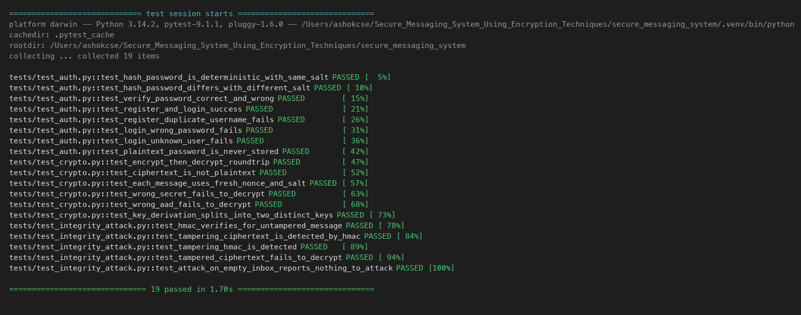

# Secure Messaging System Using Encryption Techniques

A command-line (CLI) application written in **Python 3** that demonstrates a
secure messaging system. Users register and log in, then exchange messages that
are **encrypted with AES-GCM** and protected against tampering with
**HMAC-SHA256**. The project also includes a **Man-in-the-Middle (MITM)
tampering attack simulation** and a **security logging** system.

> Educational university project for a Software Security course. The focus is on
> clarity and demonstrating core security concepts, not production hardening.

---

## Features

- User **registration** and **login** with a simple CLI menu.
- Passwords stored using **PBKDF2-HMAC-SHA256** with a random per-user salt
  (never plaintext).
- Basic **session handling** (a `current_user` after login).
- **AES-GCM** symmetric encryption of messages with a fresh random nonce each
  time.
- Encryption keys are **derived from a user-entered shared secret** with PBKDF2
  — keys are **never hardcoded** and the secret is **never stored**.
- **HMAC-SHA256** message integrity over sender, receiver, timestamp, nonce,
  salt and ciphertext.
- **Tampering detection**: any modification of a stored message is detected.
- **Attack simulation**: flip a byte of the ciphertext or HMAC and watch the
  integrity check fail.
- **Security logging** of login attempts, encryption events, failed
  decryptions and attack results.

---

## Project structure

```
secure_messaging_system/
├── app.py                 # CLI entry point (the menu)
├── auth.py                # registration, login, password hashing
├── crypto_utils.py        # AES-GCM encryption + HMAC integrity
├── database.py            # SQLite storage (users, messages, logs)
├── logger_utils.py        # security logging
├── attack_simulation.py   # MITM / tampering simulation
├── demo_data.py           # creates demo users alice & bob + a demo message
├── view_db.py             # optional: print raw DB contents for screenshots
├── conftest.py            # lets pytest import the modules
├── requirements.txt
├── README.md
├── REPORT_DRAFT.md
├── USER_GUIDE.md
├── screenshots_needed.md
└── tests/
    ├── test_auth.py
    ├── test_crypto.py
    └── test_integrity_attack.py
```

The SQLite database file `secure_messages.db` is created automatically.

---

## Installation

Requires Python 3.8+.

```bash
cd secure_messaging_system
python -m pip install -r requirements.txt
```

This installs the `cryptography` package (for AES-GCM) and `pytest` (for tests).

---

## How to run

Optionally seed two demo users first:

```bash
python demo_data.py     # creates alice & bob (password: Password123!)
```

Then start the app:

```bash
python app.py
```

Use the menu to register, log in, send encrypted messages, view your inbox,
run the attack simulation and view the logs.

---

## How to test

```bash
pytest          # or: pytest -v
```

The tests cover password hashing/verification, AES encrypt/decrypt round trips,
wrong-secret failure and HMAC tampering detection.

---

## Screenshots

Pre-generated screenshots of every feature are in the [`screenshots/`](screenshots/)
folder:

| Feature | Image |
|---|---|
| Registration | `screenshots/screenshot_registration.png` |
| Login | `screenshots/screenshot_login.png` |
| Sending an encrypted message | `screenshots/screenshot_send_message.png` |
| Encrypted data in the database | `screenshots/screenshot_encrypted_db.png` |
| Decrypted inbox | `screenshots/screenshot_decrypted_inbox.png` |
| Tampering attack | `screenshots/screenshot_attack.png` |
| Integrity check failure | `screenshots/screenshot_integrity_failure.png` |
| Security logs | `screenshots/screenshot_logs.png` |
| Test results (19 passed) | `screenshots/test_results.png` |



---

## Security design

**Password storage** — On registration a random 16-byte salt is generated and
the password is hashed with PBKDF2-HMAC-SHA256 (200,000 iterations). Only the
salt and hash are stored. Login re-derives the hash and compares it in constant
time.

**Message encryption** — For every message a random 16-byte salt and 12-byte
nonce are generated. A 64-byte key is derived from the shared chat secret + salt
using PBKDF2-HMAC-SHA256, then split into a 32-byte AES key and a 32-byte HMAC
key. The message is encrypted with AES-256-GCM. Sender, receiver and timestamp
are passed as Additional Authenticated Data (AAD).

**Integrity** — An HMAC-SHA256 tag is computed over
`sender | receiver | timestamp | nonce | salt | ciphertext`. On receipt the HMAC
is verified **before** decryption is attempted; AES-GCM provides a second,
independent integrity check.

**Key handling** — The shared secret is entered with `getpass`, used only in
memory, and never written to the database or logs. Keys are derived on demand
and never hardcoded.

---

## Limitations

- The shared chat secret must be exchanged out-of-band (the app does not
  implement key exchange such as Diffie-Hellman).
- The SQLite database file itself is not encrypted at rest; it relies on the
  message-level encryption.
- No protection against an attacker who can run code on the same machine.
- No rate limiting / account lockout on repeated failed logins.
- Single-machine demo — there is no real network layer; the MITM attack is
  simulated by editing the stored message.

These are acceptable for an educational demonstration and are discussed further
in `REPORT_DRAFT.md`.
