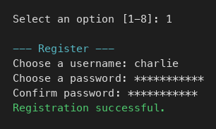
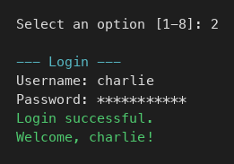
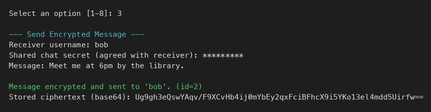
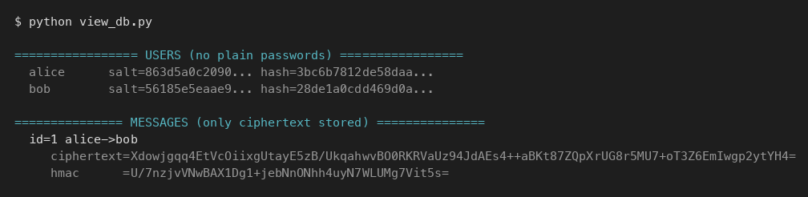
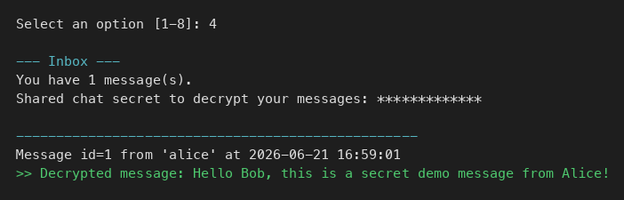
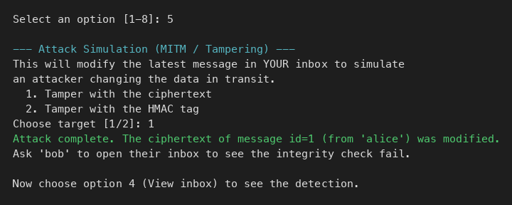
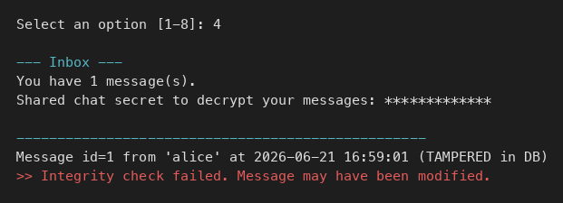
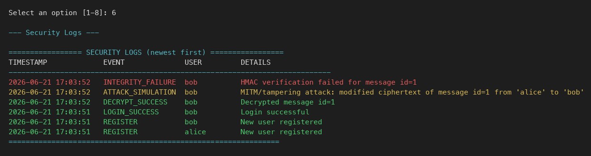

<!--
REPORT_DRAFT.md
This is a draft university report. Replace the items in [SQUARE BRACKETS] with
your own details, paste in your screenshots where indicated, and adjust wording
to match your course requirements.
-->

# Secure Messaging System Using Encryption Techniques

### Cover Page

**Project Title:** Secure Messaging System Using Encryption Techniques
**Course:** [Software Security]
**Student Name:** [Your Name]
**Roll / Registration Number:** [Your ID]
**Department:** [Your Department]
**Institution:** [Your University]
**Guide / Instructor:** [Instructor Name]
**Submission Date:** [Date]

---

## 1. Introduction

Secure communication is one of the core problems of modern computing. When two
people exchange messages, an attacker on the network may try to **read** the
messages (a confidentiality attack) or **modify** them (an integrity attack).
This project implements a small but complete **command-line secure messaging
system** in Python 3 that defends against both threats using well-established
cryptographic techniques: symmetric encryption with **AES-GCM** and message
authentication with **HMAC-SHA256**. It also demonstrates a **tampering attack**
and shows how the system detects it.

## 2. Objective

- Build a working CLI application where users can register, log in and exchange
  messages.
- Store passwords securely using salted password hashing.
- Encrypt every message with a symmetric cipher (AES) so the stored data is
  unreadable without the secret.
- Guarantee message integrity using HMAC so any modification is detected.
- Avoid hardcoded keys; derive keys from a user-supplied shared secret.
- Simulate a Man-in-the-Middle / tampering attack and detect it.
- Log all security-relevant events.

## 3. Tools and Technologies

| Tool / Library | Purpose |
|----------------|---------|
| Python 3 | Implementation language |
| sqlite3 | Lightweight database for users, messages and logs |
| hashlib | PBKDF2-HMAC-SHA256 for password and key derivation |
| hmac | HMAC-SHA256 message integrity tags |
| secrets | Cryptographically secure random salts and nonces |
| getpass | Hidden input for passwords and shared secrets |
| datetime | Timestamps for messages and logs |
| cryptography | AES-GCM authenticated encryption |
| pytest | Automated testing |

## 4. System Design

The application is split into focused modules:

```
app.py              -> CLI menu and session handling
auth.py             -> register / login / password hashing
crypto_utils.py     -> AES-GCM encryption + HMAC integrity + key derivation
database.py         -> SQLite tables: users, messages, logs
logger_utils.py     -> security event logging
attack_simulation.py-> MITM / tampering simulation
demo_data.py        -> demo users and a demo message
```

**Data flow when sending a message:**

```
plaintext + shared secret
      │
      ▼ PBKDF2 (secret + random salt) -> AES key + HMAC key
      ▼ AES-GCM(nonce, plaintext, AAD) -> ciphertext
      ▼ HMAC-SHA256(sender|receiver|time|nonce|salt|ciphertext)
      ▼
store: sender, receiver, timestamp, nonce, salt, ciphertext, hmac (base64)
```

**Database tables:**

- `users(id, username, salt, password_hash, created_at)`
- `messages(id, sender, receiver, timestamp, nonce, salt, ciphertext, hmac, tampered)`
- `logs(id, timestamp, event_type, username, details)`

## 5. User Authentication Module

Registration generates a random 16-byte salt and hashes the password with
**PBKDF2-HMAC-SHA256 (200,000 iterations)**. Only the salt and the resulting
hash are stored — never the plaintext password. Duplicate usernames are rejected
both by an application check and a database `UNIQUE` constraint.

Login re-derives the hash from the entered password and the stored salt, then
compares it to the stored hash using a **constant-time** comparison
(`secrets.compare_digest`) to prevent timing attacks. To avoid revealing which
usernames exist, the same generic error ("Invalid username or password") is
returned for both unknown users and wrong passwords. Every login attempt is
logged as `LOGIN_SUCCESS` or `LOGIN_FAILURE`.

**Registration:**



**Login:**



## 6. Symmetric Encryption Module

Messages are encrypted with **AES-256 in GCM mode**. For each message:

- A fresh random **16-byte salt** and **12-byte nonce** are generated.
- A 64-byte key is derived from the **shared chat secret + salt** using PBKDF2,
  then split into a 32-byte AES key and a 32-byte HMAC key.
- The plaintext is encrypted with AES-GCM, with sender/receiver/timestamp passed
  as Additional Authenticated Data (AAD).

Because keys are derived from a user-entered secret, **no key is hardcoded**, and
the random salt means the same secret yields different keys for every message.

**Sending an encrypted message** (the stored value is base64 ciphertext, not the
plaintext):



**Only ciphertext (never plaintext) is stored in the database:**



## 7. Message Integrity Using HMAC

In addition to GCM's built-in authentication tag, an explicit **HMAC-SHA256** is
computed over `sender | receiver | timestamp | nonce | salt | ciphertext`. On
receipt, the HMAC is verified **before** any decryption is attempted. If the
HMAC does not match, the message is rejected with:

> Integrity check failed. Message may have been modified.

This guarantees that changing any of the protected fields (including the
ciphertext) is detected.

**A valid message decrypts successfully in the inbox:**



## 8. Attack Simulation

The `attack_simulation.py` module simulates a **Man-in-the-Middle tampering
attack**: it takes the latest stored message and flips a single byte of either
the ciphertext or the HMAC tag, then saves it back to the database (mirroring an
attacker modifying data in transit). When the receiver opens their inbox, the
HMAC verification fails and the modification is detected and logged
(`INTEGRITY_FAILURE` / `ATTACK_SIMULATION`).

**Running the tampering attack:**



**The tampering is detected when the receiver opens the message:**



## 9. Logging System

Every security-relevant event is written to the `logs` table with a timestamp,
an event type, the username and a human-readable description. Logged event types
include: `REGISTER`, `LOGIN_SUCCESS`, `LOGIN_FAILURE`, `ENCRYPT`,
`DECRYPT_SUCCESS`, `DECRYPT_FAILURE`, `INTEGRITY_FAILURE`, `ATTACK_SIMULATION`
and `LOGOUT`. No secrets or plaintext are ever logged. Logs are viewable from
menu option 6.



## 10. Testing and Results

Automated tests are provided with `pytest`:

- `test_auth.py` — password hashing is deterministic with the same salt,
  differs with different salts, verification works, duplicate usernames and
  wrong passwords are rejected, and plaintext passwords are never stored.
- `test_crypto.py` — AES encrypt/decrypt round trip, ciphertext hides the
  plaintext, fresh nonce/salt per message, and decryption fails with the wrong
  secret or wrong AAD.
- `test_integrity_attack.py` — HMAC verifies for untampered messages and fails
  after the ciphertext or HMAC is tampered with; tampered ciphertext fails to
  decrypt.

Run with:

```bash
pytest -v
```

All 19 tests pass:


## 11. Screenshots to Include

All required screenshots are embedded in the relevant sections above and are
also collected in the [`screenshots/`](screenshots/) folder:

| # | Screenshot | File |
|---|------------|------|
| 1 | Registration | `screenshots/screenshot_registration.png` |
| 2 | Login | `screenshots/screenshot_login.png` |
| 3 | Sending a message | `screenshots/screenshot_send_message.png` |
| 4 | Encrypted data in the database | `screenshots/screenshot_encrypted_db.png` |
| 5 | Decrypted inbox | `screenshots/screenshot_decrypted_inbox.png` |
| 6 | Tampering attack | `screenshots/screenshot_attack.png` |
| 7 | Integrity check failure | `screenshots/screenshot_integrity_failure.png` |
| 8 | Security logs | `screenshots/screenshot_logs.png` |
| 9 | Test results | `screenshots/test_results.png` |

## 12. Security Analysis

- **Confidentiality:** AES-256-GCM protects message contents; without the shared
  secret the ciphertext is unreadable.
- **Integrity & Authenticity:** HMAC-SHA256 (plus GCM's tag) ensures any change
  to the message is detected.
- **Password security:** PBKDF2 with a random salt makes precomputed
  (rainbow-table) attacks and brute force expensive.
- **Key management:** keys are derived on demand from a secret and never stored
  or hardcoded; the secret is entered via `getpass`.
- **Replay/identity binding:** sender, receiver and timestamp are authenticated
  via AAD and the HMAC, binding each ciphertext to its context.

## 13. Limitations

- The shared secret must be exchanged out-of-band; no automated key exchange
  (e.g. Diffie-Hellman) is implemented.
- The SQLite file is not encrypted at rest (security relies on message-level
  encryption).
- No account lockout / rate limiting on failed logins.
- No protection against a local attacker with code execution on the machine.
- The MITM attack is simulated on stored data rather than over a real network.

## 14. Conclusion

This project demonstrates the practical building blocks of secure messaging:
salted password hashing, authenticated symmetric encryption, message integrity
with HMAC, secure key derivation, attack simulation and logging — all in a
clear, well-commented Python CLI. It successfully encrypts messages, detects
tampering, and records security events, meeting all stated objectives while
remaining simple enough to explain and extend.
